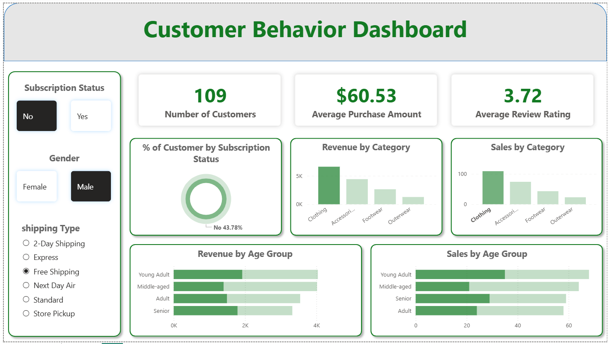
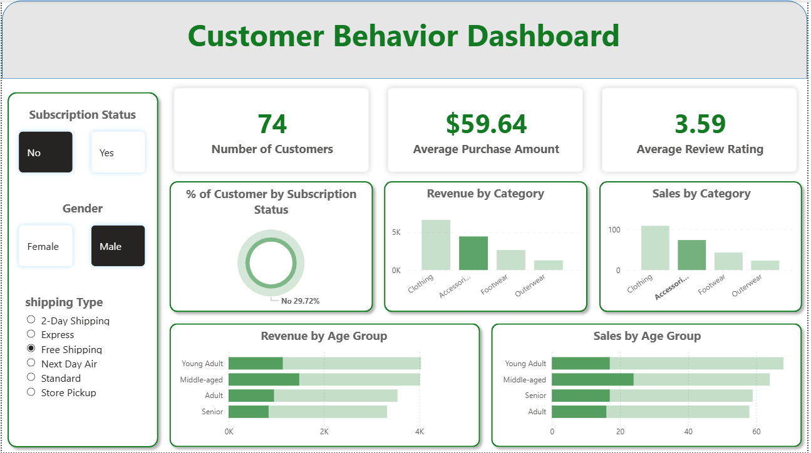
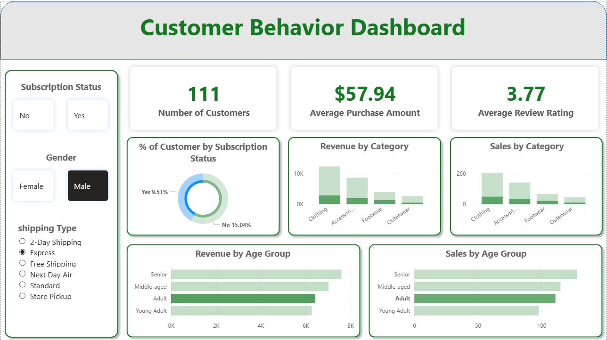
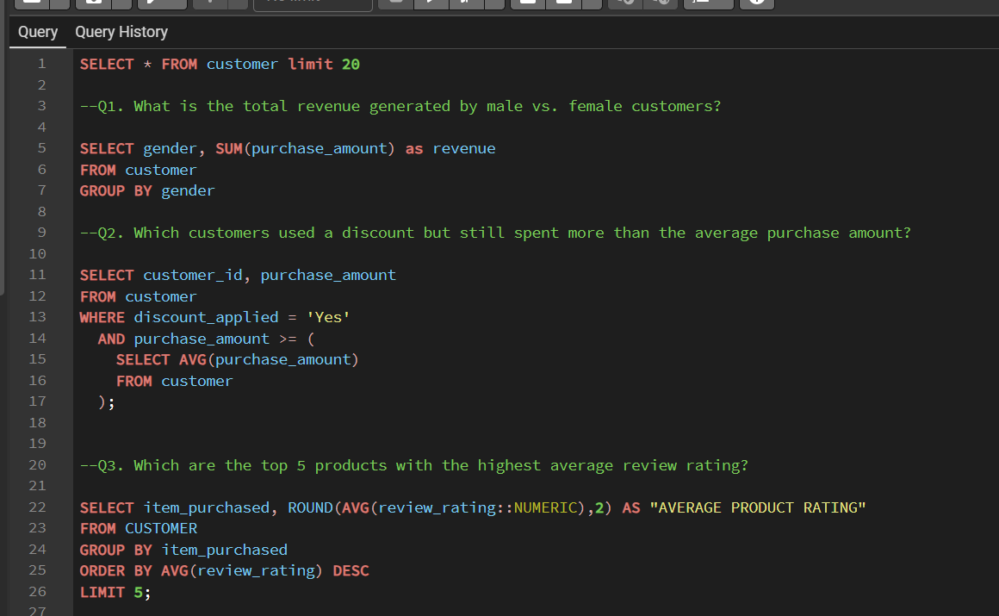
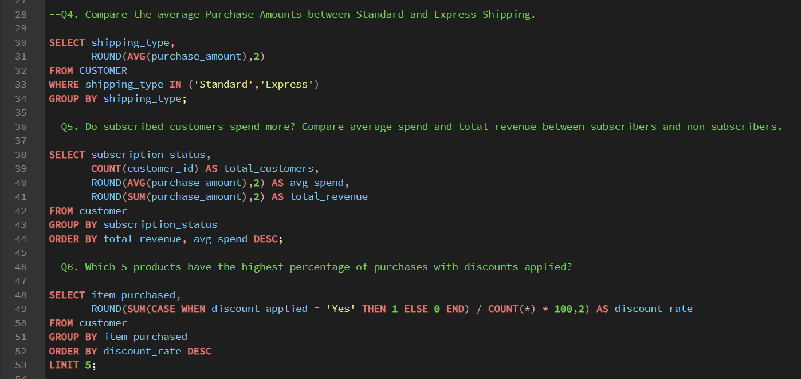
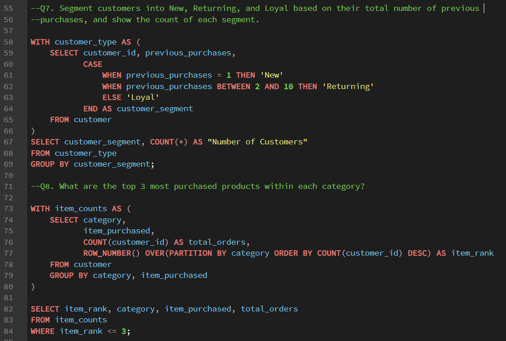
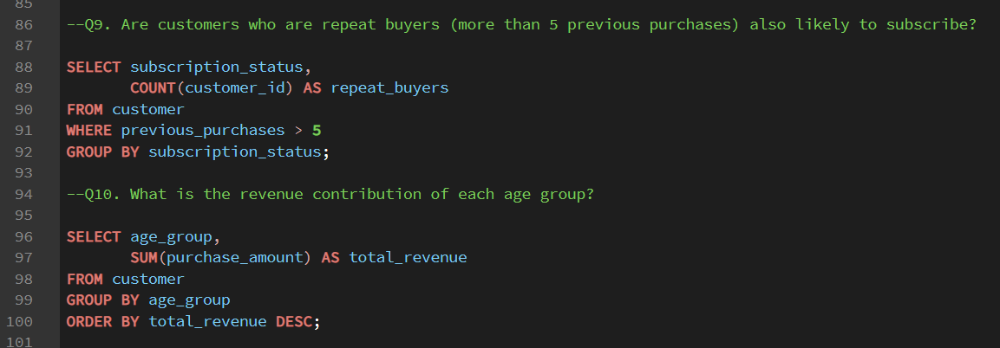

# Sales-Analytics-Dashboard-using-Python-SQL-Power-BI

Built a complete data analytics pipeline using Python, SQL, and Power BI to clean, analyze, and visualize data, generating actionable business insights.

## Tools & Technologies
- Python, SQL
- Power BI
- Excel, Tableau

## Dashboard Preview
Here are sample views of the interactive Power BI dashboard:

## SQL Query Outputs
SQL queries were used to extract and transform customer shopping behavior data:

## Key Insights
- Customer purchase trends and seasonal behavior
- Impact of discounts and payment methods
- Actionable KPIs for business growth
- Data‑driven decisions to improve customer engagement
